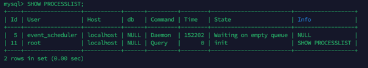

## MySql常用命令总结
### 显示当前正在执行的连接和查询进程的列表命令
```mysql
SHOW PROCESSLIST
```



`SHOW PROCESSLIST`是MySQL提供的一个命令或语句，用于显示当前正在执行的连接和查询进程的列表。它的作用主要有以下几个方面：

1. **监控数据库活动**：通过查看连接和查询进程的列表，可以实时监控数据库服务器上的活动情况，了解哪些连接正在执行哪些查询语句，以及查询的状态和执行时间等信息。
2. **诊断性能问题**：通过`SHOW PROCESSLIST`可以检查慢查询、阻塞和死锁等问题。可以观察查询的执行时间、等待状态和锁信息，从而定位和解决性能瓶颈和问题。
3. **杀死进程**：`SHOW PROCESSLIST`返回的结果中包含每个连接的ID，可以使用该ID来杀死或终止某个连接，即停止执行该连接的查询。

需要注意的是，`SHOW PROCESSLIST`的返回结果是实时变化的，并且只显示前100条记录。如果想要查看所有的进程列表，可以使用`SHOW FULL PROCESSLIST`命令。此外，普通用户只能看到自己正在运行的线程，而root用户则能看到所有正在运行的线程。

总的来说，`SHOW PROCESSLIST`是一个非常有用的命令，它可以帮助数据库管理员和开发者实时监控和诊断数据库的性能和运行情况，从而优化数据库的性能和提高系统的稳定性。

### 查看MySql隔离级别
```mysql
show variables like 'transaction_isolation';
```
