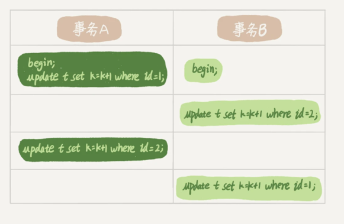
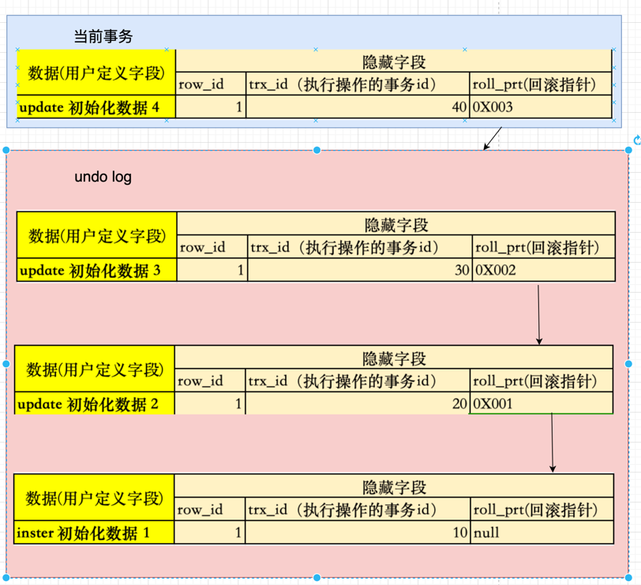
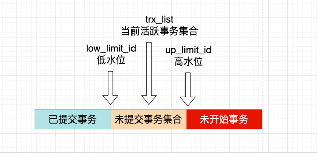

## 基础知识
### MySql查询语句基本执行过程
MySQL语句的执行过程涉及到多个组件和阶段，具体如下：
1. **连接器**：客户端通过TCP/IP协议与MySQL服务器建立连接，需要提供用户名、密码等信息进行身份验证。成功连接后,获取权限，会创建一个会话，用于后续的SQL操作。
2. **查询缓存**：在执行任何查询之前，MySQL会检查查询缓存中是否有匹配的查询结果。如果存在，则直接返回缓存结果，避免了后续的解析和执行步骤。如果缓存中没有找到对应的结果，则继续下一步。
3. **分析器**：包括词法分析和语法分析两个部分。首先，MySQL识别出SQL语句中的关键字和标识符，然后根据MySQL的语法规则判断语句是否正确。如果语法有误，将返回错误信息。
4. **优化器**：优化器决定如何最有效地执行查询，例如选择使用哪个索引，确定多表查询的连接顺序等。优化器的目标是尽量减少查询的执行时间和占用的资源。
5. **执行器**：执行器负责调用存储引擎接口来实际执行查询。例如，对于InnoDB存储引擎，执行器会请求满足条件的第一行数据，然后逐行遍历，直到所有满足条件的行都被检索出来。
6. **结果返回**：将满足条件的记录集或受影响的行数返回给客户端。如果是查询操作，则返回查询结果；如果是插入、更新或删除操作，则返回受影响的行数。
7. **清理阶段**：完成查询后，关闭连接，释放资源。

以上是MySQL执行SQL语句的基本过程。需要注意的是，这个过程可能会因为不同的存储引擎、查询类型以及是否使用了索引等因素而有所不同。此外，为了提高性能，MySQL还可能进行一些额外的内部优化，比如预读取、延迟写入等。

### MySql建立连接后,断开连接时间
客户端如果太长时间没动静，连接器就会自动将它断开。这个时间是由参数 wait_timeout 控制的，默认值是 8 小时。

如果在连接被断开之后，客户端再次发送请求的话，就会收到一个错误提醒： Lost connection to MySQL server during query。这时候如果你要继续，就需要重连，然后再执行请求了。

### 什么是数据库里面的长连接与短连接
1. **长连接**是指连接成功后，如果客户端持续有请求，则一直使用同一个连接。
2. **短连接**则是指每次执行完很少的几次查询就断开连接，下次查询再重新建立一个。

### 为什么尽量使用长连接
建立连接的过程通常是比较复杂的，所以建议你在使用中要尽量减少建立连接的动作，也就是尽量使用长连接

### 为什么不建议维护过多的长连接
但全部使用长连接后，你可能会发现，有些时候 MySQL 占用内存涨得特别快，这是因为 MySQL 在执行过程中临时使用的内存是管理在连接对象里面的。这些资源会在连接断开的时候才释放。所以如果长连接累积下来，可能导致内存占用太大，被系统强行杀掉（OOM），从现象看就是 MySQL 异常重启了

### 如何解决长连接导致的内存增长问题
1. 在业务使用数据库中,我们应该设置最大维护连接数,来避免过多建立长连接,尽量增加复用
2. 定期断开长连接。使用一段时间，或者程序里面判断执行过一个占用内存的大查询后，断开连接，之后要查询再重连。
3. 如果你用的是 MySQL 5.7 或更新版本，可以在每次执行一个比较大的操作后，通过执行 mysql_reset_connection 来重新初始化连接资源。这个过程不需要重连和重新做权限验证，但是会将连接恢复到刚刚创建完时的状态。

## 日志
### 什么是redo log
解决数据库宕机重启丢失数据的问题

### 什么是binlog

### 什么是undo log

## 索引
### InnoDB 的索引模型
在 InnoDB 中，表都是根据主键顺序以索引的形式存放的，这种存储方式的表称为索引组织表。又因为前面我们提到的，InnoDB 使用了 B+ 树索引模型，所以数据都是存储在 B+ 树中的。

每一个索引在 InnoDB 里面对应一棵 B+ 树。

主键索引的叶子节点存的是整行数据。在 InnoDB 里，主键索引也被称为聚簇索引（clustered index）

非主键索引的叶子节点内容是主键的值。在 InnoDB 里，非主键索引也被称为二级索引（secondary index）。

根据上面的索引结构说明，我们来讨论一个问题：基于主键索引和普通索引的查询有什么区别？
- 如果语句是 select * from T where ID=500，即主键查询方式，则只需要搜索 ID 这棵 B+ 树；
- 如果语句是 select * from T where k=5，即普通索引查询方式，则需要先搜索 k 索引树，得到 ID 的值为 500，再到 ID 索引树搜索一次。这个过程称为回表。

也就是说，基于非主键索引的查询需要多扫描一棵索引树。因此，我们在应用中应该尽量使用主键查询。

### 索引维护,MySql中的索引选择
B+ 树为了维护索引有序性，在插入新值的时候需要做必要地维护,所以如果索引总是有序插入的,则只需要一直向后面插入一个新记录,如果不是有序的,就相对麻烦了，需要逻辑上挪动后面的数据，空出位置。

- 页分裂
而更糟的情况是,如果所在的数据页已经满了,根据 B+ 树的算法,这时候需要申请一个新的数据页,然后挪动部分数据过去。这个过程称为页分裂。在这种情况下，性能自然会受影响。除了性能外，页分裂操作还影响数据页的利用率。原本放在一个页的数据，现在分到两个页中，整体空间利用率降低大约 50%。

- 页合并
当然有分裂就有合并,当相邻两个页由于删除了数据，利用率很低之后，会将数据页做合并。合并的过程,可以认为是分裂过程的逆过程。

**自增主键防止页分裂，逻辑删除并非物理删除防止页合并**

结合以上结论,自增主键的插入数据模式,正符合了我们前面提到的递增插入的场景。每次插入一条新记录，都是追加操作，都不涉及到挪动其他记录，也不会触发叶子节点的分裂。

而有业务逻辑的字段做主键，则往往不容易保证有序插入，这样写数据成本相对较高。

除了考虑性能外，我们还可以从存储空间的角度来看。假设你的表中确实有一个唯一字段，比如字符串类型的身份证号，由于每个非主键索引的叶子节点上都是主键的值。如果用身份证号做主键，那么每个二级索引的叶子节点占用约 20 个字节，而如果用整型做主键，则只要 4 个字节，如果是长整型（bigint）则是 8 个字节。

显然，主键长度越小，普通索引的叶子节点就越小，普通索引占用的空间也就越小。所以，从性能和存储空间方面考量，自增主键往往是更合理的选择

### 为什么MySql中建议主键都使用自增主键
- 从性能考虑,自增主键可以防止页分裂
- 从存储考虑,自增主键的长度往往比业务字段的要短,主键长度越小，普通索引的叶子节点就越小，普通索引占用的空间也就越小

### 覆盖索引
**覆盖索引**是一种数据库查询优化技术，它允许数据库系统在查询过程中只访问索引本身，而不是访问数据表本身。当查询的列完全包含在索引中时，就发生了覆盖索引。这意味着查询所需的数据已经存在于索引树的叶子节点上，因此不需要回表操作，直接从索引中返回结果，这样可以减少磁盘I/O操作，提高查询效率

当然，索引字段的维护总是有代价的。因此，在建立冗余索引来支持覆盖索引时就需要权衡考虑了。这正是业务 DBA，或者称为业务数据架构师的工作。

### 最左前缀原则
顾名思义是最左优先,以最左边的为起点任何连续的索引都能匹配上。
> 结论
- B+ 树这种索引结构，可以利用索引的“最左前缀”，来定位记录,
- 最左前缀可以是联合索引的最左 N 个字段，也可以是字符串索引的最左 M 个字符

> 基于上面对最左前缀索引的说明，在建立联合索引的时候，如何安排索引内的字段顺序是很重要的。

- 第一原则是，如果通过调整顺序，可以少维护一个索引，那么这个顺序往往就是需要优先考虑采用的。
- 其次考虑的原则就是空间,[(a,b)两个字段,如果a字段大,则优先b创建单独的索引（a,b）(b)]。

### 索引最多应用一个范围列
mysql 会一直向右匹配直到遇到范围查询(> < between like)就停止匹配。范围列可以用到索引，但是范围列后面的列无法用到索引。即，索引最多用于一个范围列，因此如果查询条件中有两个范围列则无法全用到索引'

### 索引下推
MySQL 5.6 引入的索引下推优化（index condition pushdown)， 可以在索引遍历过程中，对索引中包含的字段先做判断，直接过滤掉不满足条件的记录，减少回表次数。
举例来说，如果一张表t建立a和b两个字段的索引，然后查询条件是(select * from t where like 'a%' and b=10 ')，
- 没有索引下推
1. mysql会查询到所有符合a前缀的行,然后查询到对应的主键id
2. 通过主键id,查询主键索引数据行,进行b=10比较

- 如果有索引下推
1. mysql会查询到所有符合a前缀的行,如果当前比价条件自动在当前索引覆盖,则直接在当前索引上比较进行b=10,不需要回到主键索引中比较

其实这个跟覆盖索引有点类似，二级索引里面已经有需要的数据了，就没必要去回表了。

## 锁
### MySql中的锁
数据库锁设计的初衷是处理并发问题。作为多用户共享的资源，当出现并发访问的时候，数据库需要合理地控制资源的访问规则。而锁就是用来实现这些访问规则的重要数据结构。
根据加锁的范围，MySQL 里面的锁大致可以分成全局锁、表级锁和行锁三类
> 全局锁 

全局锁就是对整个数据库实例加锁。MySQL 提供了一个加全局读锁的方法，命令是 Flush tables with read lock (FTWRL)[unlock tables可以解除]。当你需要让整个库处于只读状态的时候，可以使用这个命令 (全局锁的典型使用场景是，做全库逻辑备份)
> 表级锁 
- 表锁 表锁的语法是 lock tables … read/write。与 FTWRL 类似，可以用 unlock tables 主动释放锁，也可以在客户端断开的时候自动释放。需要注意，lock tables 语法除了会限制别的线程的读写外，也限定了本线程接下来的操作对象。**对表加读锁后，自己也不能对其进行修改；自己和其他线程只能读取该表。 当对某个表执加上写锁后（lock table t2 write），该线程可以对这个表进行读写，其他线程对该表的读和写都受到阻塞；**
- 元数据锁（meta data lock，MDL) （表结构锁） MDL 不需要显式使用，在访问一个表的时候会被自动加上,在 MySQL 5.5 版本中引入了 MDL，当对一个表做增删改查操作的时候，加 MDL 读锁；当要对表做结构变更操作的时候，加 MDL 写锁。
1. 读锁之间不互斥，因此你可以有多个线程同时对一张表增删改查。
2. 读写锁之间、写锁之间是互斥的，用来保证变更表结构操作的安全性。因此，如果有两个线程要同时给一个表加字段，其中一个要等另一个执行完才能开始执行。

>  行锁

MySQL 的行锁是在引擎层由各个引擎自己实现的。但并不是所有的引擎都支持行锁，比如 MyISAM 引擎就不支持行锁。不支持行锁意味着并发控制只能使用表锁，对于这种引擎的表，同一张表上任何时刻只能有一个更新在执行，这就会影响到业务并发度

事务中，行锁是在语句执行时才加上的，不是事务开始就加上，但释放是统一在事务结束时才释放。根据这个特性，对于高并发的行记录的操作语句就可以尽可能的安排到最后面，以减少锁等待的时间，提高并发性能

- 死锁和死锁检测
当并发系统中不同线程出现循环资源依赖，涉及的线程都在等待别的线程释放资源时，就会导致这几个线程都进入无限等待的状态，称为死锁

> 如何处理死锁
1. 一种策略是，直接进入等待，直到超时。这个超时时间可以通过参数 innodb_lock_wait_timeout 来设置（默认值50S）。
2. 另一种策略是，发起死锁检测，发现死锁后，主动回滚死锁链条中的某一个事务，让其他事务得以继续执行。将参数 innodb_deadlock_detect 设置为 on，表示开启这个逻辑。

正常情况下我们还是要采用第二种策略，即：主动死锁检测，而且 innodb_deadlock_detect 的默认值本身就是 on。主动死锁检测在发生死锁的时候，是能够快速发现并进行处理的，但是它也是有额外负担的。
> 死锁检测负担
每个新来的被堵住的线程，都要判断会不会由于自己的加入导致了死锁，这是一个时间复杂度是 O(n) 的操作。假设有 1000 个并发线程要同时更新同一行，那么死锁检测操作就是 100 万这个量级的。虽然最终检测的结果是没有死锁，但是这期间要消耗大量的 CPU 资源。因此，你就会看到 CPU 利用率很高，但是每秒却执行不了几个事务。

高并发下避免死锁检测带来的负面影响： 
1. 确保业务上不会产生死锁，直接将死锁检测关闭。（innodb 自带死锁检测）
2. 在数据库中间件中统一对更新同一行的请求进行排队，控制并发度。
3. 业务逻辑上进行优化，将一行数据分解成多行，降低写入压力。
## 事务隔离

### 数据库中的隔离性与隔离级别
SQL 标准的事务隔离级别包括：读未提交（read uncommitted）、读提交（read committed）、可重复读（repeatable read）和串行化（serializable ）。
- 读未提交是指，一个事务还没提交时，它做的变更就能被别的事务看到。
- 读提交是指，一个事务提交之后，它做的变更才会被其他事务看到。
- 可重复读是指，一个事务执行过程中看到的数据，总是跟这个事务在启动时看到的数据是一致的。当然在可重复读隔离级别下，未提交变更对其他事务也是不可见的。
- 串行化，顾名思义是对于同一行记录，“写”会加“写锁”，“读”会加“读锁”。当出现读写锁冲突的时候，后访问的事务必须等前一个事务执行完成，才能继续执行。

在实现上，数据库里面会创建一个视图，访问的时候以视图的逻辑结果为准。在“可重复读”隔离级别下，这个视图是在事务启动时创建的，整个事务存在期间都用这个视图。在“读提交”隔离级别下，这个视图是在每个 SQL 语句开始执行的时候创建的。这里需要注意的是，“读未提交”隔离级别下直接返回记录上的最新值，没有视图概念；而“串行化”隔离级别下直接用加锁的方式来避免并行访问。

### MySql事务隔离实现

### MySql是如何用'快照'在MVCC里面工作的
- 前提 **事务的启动时机**
begin/start transaction 命令并不是一个事务的起点，在执行到它们之后的第一个操作 InnoDB 表的语句，事务才真正启动。如果你想要马上启动一个事务，可以使用 start transaction with consistent snapshot 这个命令。
> 区别
1. 第一种启动方式，一致性视图是在执行第一个快照读语句时创建的；
2. 第二种启动方式，一致性视图是在执行 start transaction with consistent snapshot 时创建的。

### MVCC的实现
MySQL中MVCC的实现依赖 undo log 与 read view(一致性读视图)
> undo log
undo log是MVCC实现中的一个重要组件，用于记录数据的修改历史

下图展示了undo log 的基本运行原理

> read view
在MVCC中，Read view具有三个全局属性，分别是trx_list、up_limit_id和low_limit_id 

- **trx_list**：记录了当前活动的事务列表，其中每个事务包含一个事务ID和一个读视图。
- **up_limit_id**：(低水位)是一个全局的递增ID，用于判断事务的可见性[trx_list事务id最小值]。
- **low_limit_id**：（高水位）是一个全局的递增ID，用于判断事务的可见性[trx_list事务id最大值+1]。

当前事务启动瞬间,read view后一个事务能看见什么,如下图所示

1. 如果落在绿色部分，表示这个版本是已提交的事务或者是当前事务自己生成的，这个数据是可见的；
2. 如果落在红色部分，表示这个版本是由将来启动的事务生成的，是肯定不可见的
3. 如果落在黄色部分，那就包括两种情况
 - 若 row trx_id 在数组中，表示这个版本是由还没提交的事务生成的，不可见；
 - 若 row trx_id 不在数组中，表示这个版本是已经提交了的事务生成的，可见

> 特殊说明
已经提交的事务的id可以比最低水位大(因为事务id分配是系统提增分配的,但是事务提交时又业务自己确定的,所以可能存在先创建的事务后提交的)

举个例子
当前事务7准备创建一致性视图时 存在事务 [2,3,4,5,6,7,8]

[3,6] 为已提交事务

[2,4,5,7,8] 为未提交事务

则 低水位 事务id 为 2,高水位 为 9 

依据上面的规则我们可以得出这个公式
- DB_TRX_ID(当前事务) < up_limit_id,创建read view时,之前已提交的事务对于当前事务都可见
- DB_TRX_ID(当前事务) >= low_limit_id ,创建read view时,之后的事务对于当前事务都不可见
- up_limit_id < DB_TRX_ID < low_limit_id 则存在两种情况
  - DB_TRX_ID 存在trx_list中,不可见
  - DB_TRX_ID 不存在trx_list中,可见