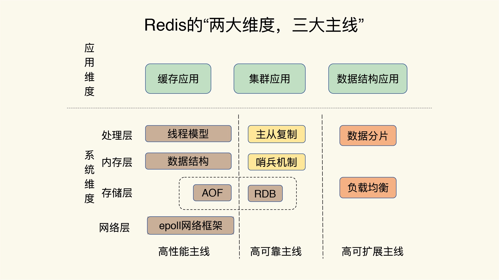

## Redis如何入门
如何花很少的时间掌握更丰富的知识和经验，解决更多的问题。主要是能抓住主线，在自己的脑海中绘制一幅 Redis 全景知识图，
## Redis全景图

Redis全景图包含:两大维度和三大主线 “两大维度”就是指系统维度和应用维度，“三大主线”也就是指高性能、高可靠和高可扩展（可以简称为“三高”）。

### 系统维度
**关键技术设计原理**：深入了解Redis的关键技术，如run-to-complete模型、epoll网络模型等，这些技术为Redis的高性能、高可靠和高可扩展性提供了支撑。

**系统设计规范**：通过学习Redis的设计，可以掌握一些优雅的系统设计规范，为未来在系统开发实践中提供指导和借鉴。
### 应用维度
**应用场景驱动**: 以Redis的广泛应用场景为驱动，如缓存和集群，通过梳理这些场景中的技术链，如缓存机制、缓存替换、缓存异常等，加深对Redis应用的理解

**典型案例驱动**: 针对Redis丰富的数据模型及其零碎的应用场景，通过典型案例的学习，特别是那些隐藏较深、特定业务场景下才会出现的问题，来加深对Redis应用的掌握。

## 三大主线
**高性能**:包括线程模型、数据结构、持久化、网络框架；

**高可靠**:包括主从复制、哨兵机制；

**高可扩展**:包括数据分片、负载均衡。

## 问题画像图

有了问题画像图你遇见什么问题，都可以拿出来这张图，这样你就能快速地按照问题来查找对应的 Redis 主线模块了，然后再进一步定位到相应的技术点上。

例如如果你遇到了 Redis 的响应变慢问题，对照着这张图，你就可以发现，这个问题和 Redis 的性能主线相关，而性能主线又和数据结构、异步机制、RDB、AOF 重写相关。找到了影响的因素，解决起来也就很容易了。