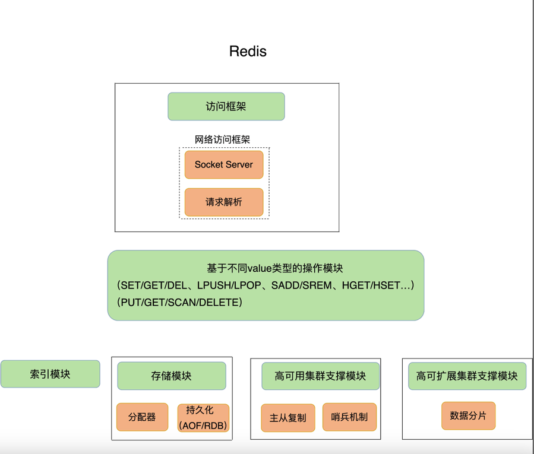
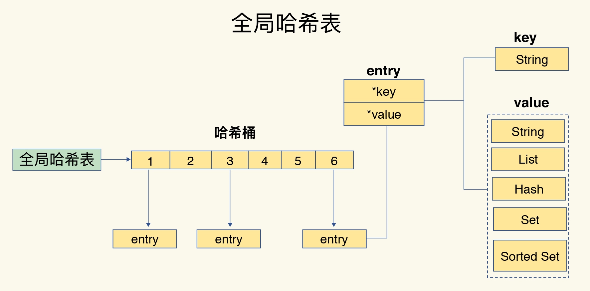
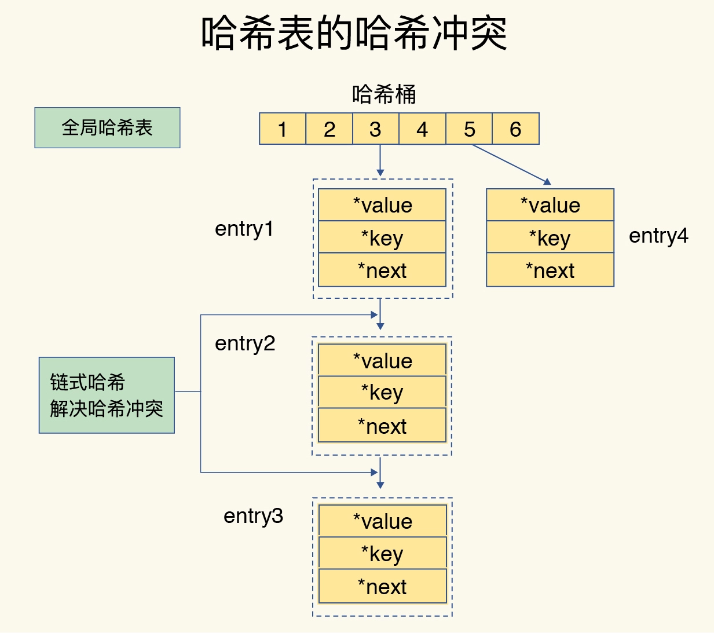
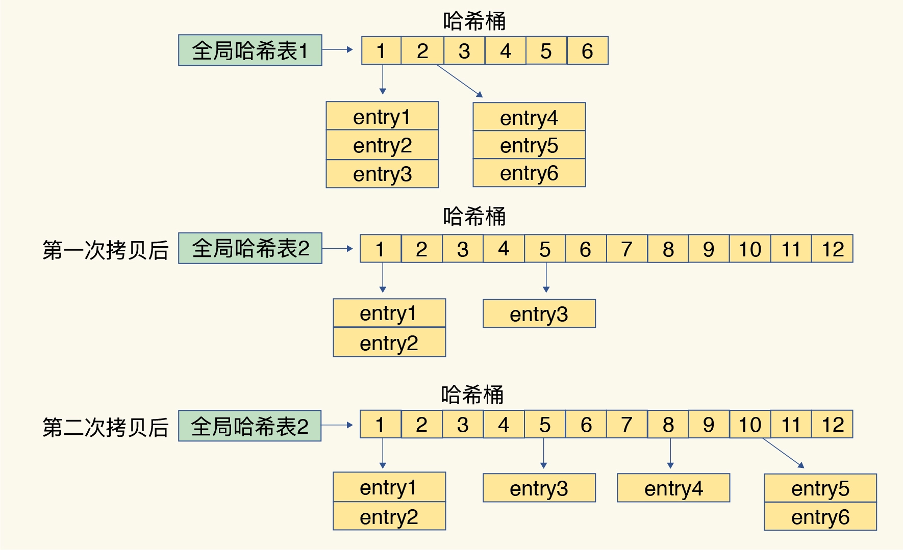
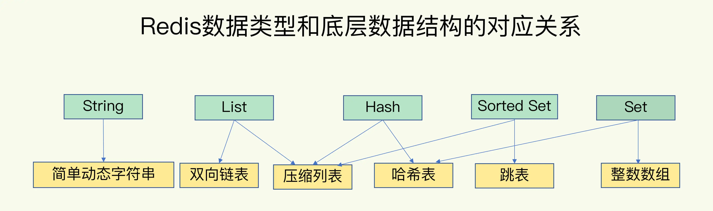
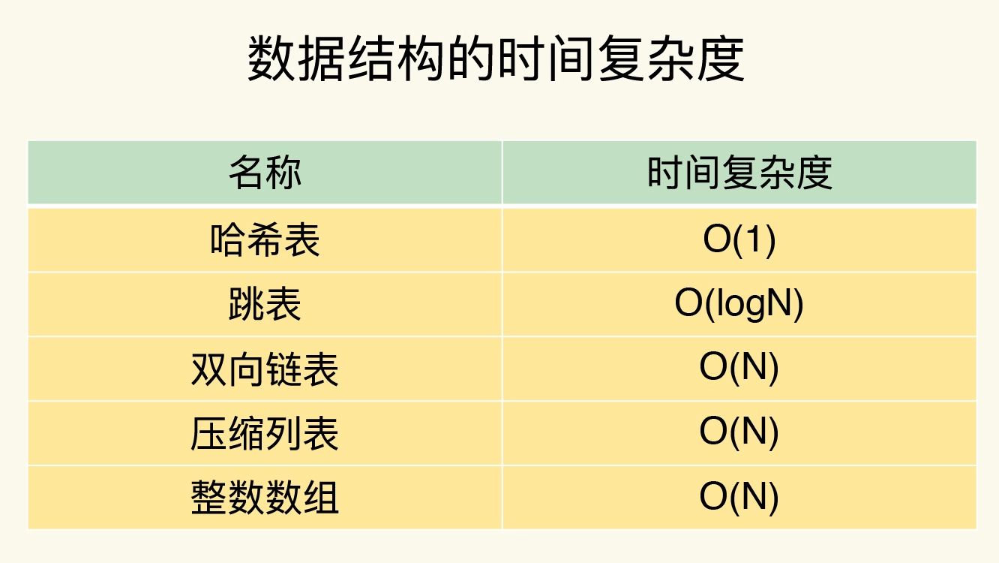

## 基础架构
大体来说一个键值数据库包括了访问框架、索引模块、操作模块和存储模块四部分（见下图）。接下来，我们就从这四个部分入手

- Redis 主要通过网络框架进行访问，而不再是动态库了，这也使得 Redis 可以作为一个基础性的网络服务进行访问，扩大了 Redis 的应用范围。
- Redis 数据模型中的 value 类型很丰富，因此也带来了更多的操作接口，例如面向列表的 LPUSH/LPOP，面向集合的 SADD/SREM 等。
- Redis 的持久化模块能支持两种方式：日志（AOF）和快照（RDB），这两种持久化方式具有不同的优劣势，影响到 Redis 的访问性能和可靠性。
- Redis 支持高可靠集群和高可扩展集群，因此，Redis 中包含了相应的集群功能支撑模块。
## 数据结构
Redis 底层使用了一个哈希表来保存所有键值对。

在Redis中这个哈希表保存了所有的键值对，所以，称为全局哈希表。哈希表的最大好处很明显，就是让我们可以用 O(1) 的时间复杂度来快速查找到键值对——我们只需要计算键的哈希值，就可以知道它所对应的哈希桶位置，然后就可以访问相应的 entry 元素。

### Redis如何解决哈希表的冲突问题和rehash可能带来的操作阻塞问题
**什么是哈希冲突**
当你往哈希表中写入更多数据时，哈希冲突是不可避免的问题。这里的哈希冲突是指，两个 key 的哈希值和哈希桶计算对应关系时，正好落在了同一个哈希桶中。

**Redis解决哈希冲突方式**
Redis解决哈希冲突的方式,就是链式哈希（类似Java中的hashmap）。链式哈希也很容易理解，就是指同一个哈希桶中的多个元素用一个链表来保存，它们之间依次用指针连接。

**链式哈希的问题**
哈希冲突链上的元素只能通过指针逐一查找再操作。如果哈希表里写入的数据越来越多，哈希冲突可能也会越来越多，这就会导致某些哈希冲突链过长，进而导致这个链上的元素查找耗时长，效率降低

**Redis中的扩容**
了解哈希表数据结构的同学都清楚,哈希冲突的解决和扩容是密不可分,Redis会对哈希表做 rehash 操作。rehash 也就是增加现有的哈希桶数量，让逐渐增多的 entry 元素能在更多的桶之间分散保存，减少单个桶中的元素数量，从而减少单个桶中的冲突。那具体怎么做呢？

**渐进式hash**
为了使 rehash 操作更高效，Redis 默认使用了两个全局哈希表：哈希表 1 和哈希表 2。一开始，当你刚插入数据时，默认使用哈希表 1，此时的哈希表 2 并没有被分配空间。随着数据逐步增多，Redis 开始执行 rehash，这个过程分为三步
1. 给哈希表 2 分配更大的空间，例如是当前哈希表 1 大小的两倍；
2. 把哈希表 1 中的数据重新映射并拷贝到哈希表 2 中；
3. 释放哈希表 1 的空间

这个过程看似简单，但是第二步涉及大量的数据拷贝，如果一次性把哈希表 1 中的数据都迁移完，会造成 Redis 线程阻塞，无法服务其他请求。此时，Redis 就无法快速访问数据了。

所以Redis采用渐进式hash方式解决，操作如下简单来说就是在第二步拷贝数据时，Redis 仍然正常处理客户端请求，每处理一个请求时，从哈希表 1 中的第一个索引位置开始，顺带着将这个索引位置上的所有 entries 拷贝到哈希表 2 中；等处理下一个请求时，再顺带拷贝哈希表 1 中的下一个索引位置的 entries

**重点:** 渐进式rehash执行时，除了根据键值对的操作来进行数据迁移，Redis本身还会有一个定时任务在执行rehash，如果没有键值对操作时，这个定时任务会周期性地（例如每100ms一次）搬移一些数据到新的哈希表中，这样可以缩短整个rehash的过程

这样就巧妙地把一次性大量拷贝的开销，分摊到了多次处理请求的过程中，避免了耗时操作，保证了数据的快速访问。

### Redis value类型的数据结构
简单来说，底层数据结构一共有 6 种，分别是简单动态字符串、双向链表、压缩列表、哈希表、跳表和整数数组

**双向链表**
Redis的List值类型都依赖
**压缩列表**
Redis的List,Hash,Sorted set 值类型都依赖
**哈希表**
Redis的Hash,Set 值类型都依赖
**跳表**
Redis的Sorted set 值类型都依赖
**整数数组**
Redis的Set 值类型都依赖

> 常用

哈希表存储和查询基本都O(1),底层数据+链表

整数数组和双向链表也很常见，它们的操作特征都是顺序读写，也就是通过数组下标或者链表的指针逐个元素访问，操作复杂度基本是 O(N)，操作效率比较低

> **压缩列表:**

压缩列表实际上类似于一个数组，数组中的每一个元素都对应保存一个数据。和数组不同的是，压缩列表在表头有三个字段 zlbytes、zltail 和 zllen，分别表示列表长度、列表尾的偏移量和列表中的 entry 个数；压缩列表在表尾还有一个 zlend，表示列表结束

在压缩列表中，如果我们要查找定位第一个元素和最后一个元素，可以通过表头三个字段的长度直接定位，复杂度是 O(1)。而查找其他元素时，就没有这么高效了，只能逐个查找，此时的复杂度就是 O(N) 了。

> **跳表:**

有序链表只能逐一查找元素，导致操作起来非常缓慢，于是就出现了跳表。具体来说，跳表在链表的基础上，增加了多级索引，通过索引位置的几个跳转，实现数据的快速定位，

### 整数数组和压缩列表在查找时间复杂度方面并没有很大的优势，那为什么 Redis 还会把它们作为底层数据结构呢？
两方面原因：

1.内存利用率，数组和压缩列表都是非常紧凑的数据结构，它比链表占用的内存要更少。Redis是内存数据库，大量数据存到内存中，此时需要做尽可能的优化，提高内存的利用率。

2.数组对CPU高速缓存支持更友好，所以Redis在设计时，集合数据元素较少情况下，默认采用内存紧凑排列的方式存储，同时利用CPU高速缓存不会降低访问速度。当数据元素超过设定阈值后，避免查询时间复杂度太高，转为哈希和跳表数据结构存储，保证查询效率。