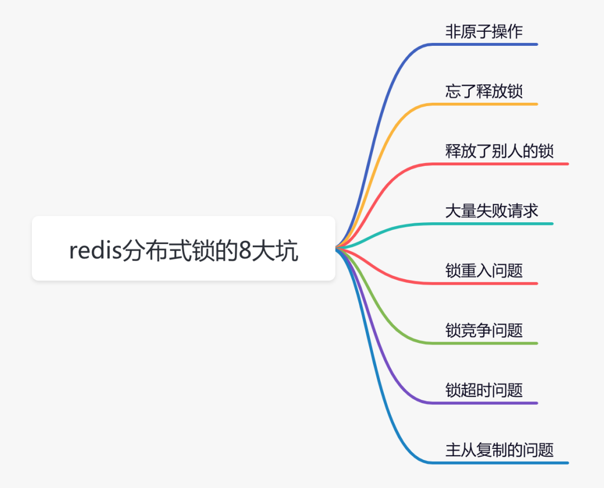
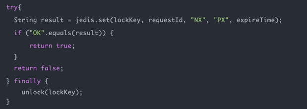
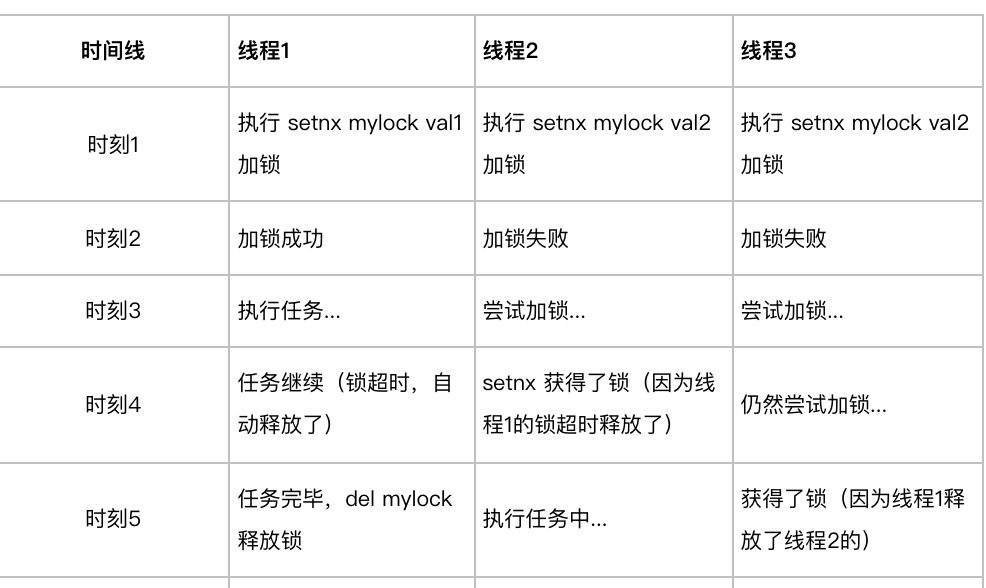
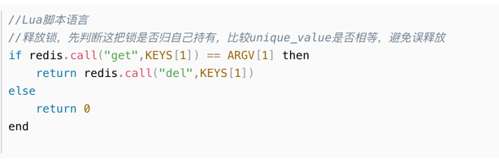

## Redis为什么这么快
Redis之所以这么快，主要得益于以下几个方面：
1. **基于内存存储**：Redis将数据存储在内存中，而不是磁盘上。内存的访问速度比磁盘快得多，这使得Redis能够实现非常快的读写速度。当然，由于内存是易失性存储，Redis也提供了持久性选项，可以将数据定期写入磁盘以防止数据丢失。
2. **高效的数据结构**：Redis提供了多种高效的数据结构，如哈希表、跳跃表、列表和集合等。这些数据结构被设计成可以快速地插入、查询和删除数据。例如，有序集合可以存储有序的元素，非常适合实现排行榜等功能。
3. **使用单线程模型**：Redis使用单个线程处理所有的客户端请求，避免了多线程或多进程导致的上下文切换和锁竞争，从而减少了CPU的消耗。同时，由于Redis是基于内存操作的，因此绝大部分请求都是纯粹的内存操作，非常快速。
4. **IO多路复用**：Redis使用IO多路复用技术来处理多个客户端请求，这使得Redis能够在高并发环境下处理大量的请求。通过同时监察多个流的IO事件，Redis可以在单个线程中高效地处理多个连接请求，从而提高了吞吐量。
5. **原子性操作**：Redis的所有操作都是原子性的，这意味着在执行一个操作时，不会被其他操作打断。这保证了数据的完整性和一致性，同时也避免了并发操作导致的性能下降。

综上所述，Redis之所以这么快，主要得益于其基于内存存储、高效的数据结构、使用单线程模型、IO多路复用以及原子性操作等特点。这些特点使得Redis在处理大量数据时能够保持高性能和稳定性，非常适合作为缓存或消息中间件等场景下的数据存储方案。

### Redis的全局哈希表

Redis的全局哈希表是实现从键到值的快速访问的关键数据结构。在Redis中，无论是哪种数据类型，它们都是以键值对的形式存储在全局哈希表中的。这个全局哈希表使用字典（dict）来实现，其中字典的每个条目称为dictEntry，它包含了具体的键值对内容。

当需要访问某个键对应的值时，Redis会首先计算键的哈希值，然后根据这个哈希值找到对应的哈希桶位置，从而访问相应的dictEntry元素。如果多个键的哈希值相同（即哈希冲突），Redis使用链式哈希来解决，即同一个哈希桶中的多个元素用一个链表来保存，它们之间依次用指针连接。

此外，Redis的哈希表实现还考虑到了扩容和收缩的情况。当哈希表中的元素数量超过一定阈值时，Redis会进行扩容操作，创建一个更大的哈希表，并将原有哈希表中的数据重新映射到新的哈希表中。相反，当哈希表中的元素数量减少到一定程度时，Redis会进行收缩操作，释放不必要的内存空间。

总之，Redis的全局哈希表是实现其高性能和快速访问的关键数据结构之一。通过合理的哈希算法、链式哈希冲突解决策略以及动态扩容收缩机制，Redis能够高效地存储和访问大量的键值对数据。

### Redis的全局哈希表的扩容过程
Redis的全局哈希表的扩容过程是一个自适应的过程，当哈希表的装载因子（即哈希表中已存储的元素数量与哈希表大小的比值）超过一定阈值时，Redis会自动触发扩容操作。默认情况下，这个阈值是0.75。

以下是Redis哈希表扩容的详细过程：

1. **分配新空间**：Redis会预先分配一块新的内存空间作为哈希表，这个新哈希表的大小是原哈希表大小的两倍。例如，如果原哈希表的大小是4，那么新哈希表的大小就是8。
2. **数据迁移**：Redis开始将原哈希表中的键值对逐个重新散列（rehash）到新的哈希表中。这个过程是通过一个游标来遍历原哈希表中的所有槽（slot），对每个槽中的键值对进行重新计算哈希值，并根据新的哈希值将它们放到新哈希表的对应位置上。如果新哈希表的槽中已经存在其他键值对，Redis会使用链表将它们串联起来，形成一个链表。这个过程是渐进式的，会分批执行，以避免一次性操作导致Redis的响应时间受到影响。
3. **更新哈希表**：当所有键值对都被重新散列到新的哈希表后，Redis会将新的哈希表设置为当前使用的哈希表，同时释放旧的哈希表，回收内存。

需要注意的是，在扩容过程中，如果有增删改查操作，Redis会根据一个索引计数器变量（rehashidx）来判断键值对应该放在哪个哈希表中。如果索引值大于rehashidx，那么键值对会被放在新的哈希表中，否则会被放在旧的哈希表中。在rehash期间，每次对字典执行增删改查操作，除了执行指定的操作以外，还会顺带将原哈希表在rehashidx索引上的所有键值对rehash到新哈希表。

通过这种渐进式rehash的方式，Redis可以在扩容过程中保持较高的性能，同时保证数据的一致性。

## Redis合适的应用场景
### 限流
使用Redis还有一个非常常用的的业务场景是做限流。当然还有其他的限流方式，比如：使用nginx，但使用Redis控制可以更精细。比如：限制同一个ip，1分钟之内只能访问10次接口，10分钟之内只能访问50次接口，1天之内只能访问100次接口。如果超过次数，则接口直接返回：请求太频繁了，请稍后重试。跟上面保存用户登录状态类似，需要在Redis中保存用户的请求记录。比如：key是用户ip，value是访问的次数从1开始，后面每访问一次则加1。如果value超过一定的次数，则直接拦截这种异常的ip。当然也需要设置一个过期时间，异常ip如果超过这个过期时间，比如：1天，则恢复正常了，该ip可以再发起请求了。或者限制同一个用户id。

### 用户登录状态
通常下，用户登录成功之后，用户登录之后的状态信息，会保存到Redis中。这样后面该用户访问其他接口的时候，会直接从Redis中查询用户登录状态，如果可以查到数据，说明用户已登录，则允许做后续的操作。如果从Redis中没有查到用户登录状态，说明该用户没有登录，或者登录状态失效了，则直接跳转到用户登录页面。使用Redis保存用户登录状态，有个好处是它可以设置一个过期时间，比如：该时间可以设置成30分钟。jedis.set(userId, userInfo, 1800);

在Redis内部有专门的job，会将过期的数据删除，也有获取数据时实时删除的逻辑。

### 分布式锁
https://mp.weixin.qq.com/s?__biz=MzkwNjMwMTgzMQ==&mid=2247490430&idx=1&sn=a1f42f9a981a8f161941a6472f317b10&chksm=c0ebc396f79c4a801a330917ca700e7d7a6af3a3c2c5a4e11a05770da925de8aa9ed3c277737&token=795379312&lang=zh_CN&scene=21#wechat_redirect

#### Redis使用分布式锁需要注意的问题
1. **非原子性操作** 加锁操作和设置超市时间分开,假如加锁成功，但是设置超时时间失败了，该lockKey就变成永不失效。假如在高并发场景中，有大量的lockKey加锁成功了，但不会失效，有可能直接导致redis内存空间不足。
2. **忘记释放锁**
   - 我们除了要保证原子操作外,切记还需要在使用完成锁后,主动释放锁,不要都等到锁过期时间后自动释放，这样系统并发量会很低,系统性能下降严重
   - 需要捕获业务代码的异常，然后在finally中释放锁。换句话说就是：无论代码执行成功或失败了，都需要释放锁。

3. **释放了别人的锁******

如上所示,线程1就释放了线程2的锁，导致线程2和线程3一起执行了
> 如何避免锁被被人释放
- 客户端加锁时,设置一个自己知道的唯一标识进去,只能自己解除自己的锁
  - 线程ID
  - UUID (随机且唯一)

## 缓存更新策略
1. 内存淘汰 redis内部机制
2. 超时剔除 
3. 主动更新
总结 先更新数据库 在删除缓存
## 缓存穿透
客户端请求的缓存和数据库中不存在,这样缓存永远不会生效,这些请求都打到数据库

> 解决方案
1. 缓存空对象
    - 优点 实现简单 维护方便
    - 缺点  1. 额外的内存消耗 2. 可能造成短期的不一致
2. 布隆过滤 
    - 优点 内存占用较少,没有多余key
    - 缺点 1. 实现复杂 2. 存在误判可能

## 缓存雪崩
同一段时间大量缓存的key同时失效,导致大量请求到达数据库
> 解决方案
1. 给不同key设置TTL添加随机值
2. 利用Redis集群提高服务的可能性 
3. 给缓存业务添加降级限流策略
4. 给业务添加多级缓存

## 缓存击穿
缓存击穿也叫做热点key问题,就是一个被高并发访问并且缓存重建业务比较复杂的key突然失效了,无数请求访问会瞬间给数据库带来巨大压力

> 解决方案
1. 互斥锁
    - 优点 保证一致性 实现简单
    - 缺点 线程需要等待,性能存在影响 可能存在死锁风险
2. 逻辑过期
    - 优点 线程无效等待,性能好
    - 缺点 不保证一致性,有额外内存消耗,实现复杂 

## 双写一致性问题

先写数据库 后删除缓存，因为这样可以减少最少时间的数据不一致情况

延迟双删除，是为了更少的减少数据不一致的情况，他解决的是，写完数据库 删除数据库时，有一个线程查询的还是老数据，但是写缓存时在删缓存之后了，这样又造成了数据不一致，延迟双删可以一定的避免这个问题，但是延迟时间并不好确定，所以只能尽量的减少不一致的时间，不能保证强一致

## redis高可用演进
### 1. 单机->主从 

解决高并发的问题，可以解决读多写少的问题

- 主从全量同步过程

- 主从增量同步过程

### 主从->哨兵模式

解决主从模式的高可用问题，可以解决写库挂机后的恢复问题

- 哨兵的选举过程

### 哨兵-> 分片集群问题

解决高可用 高并发 

